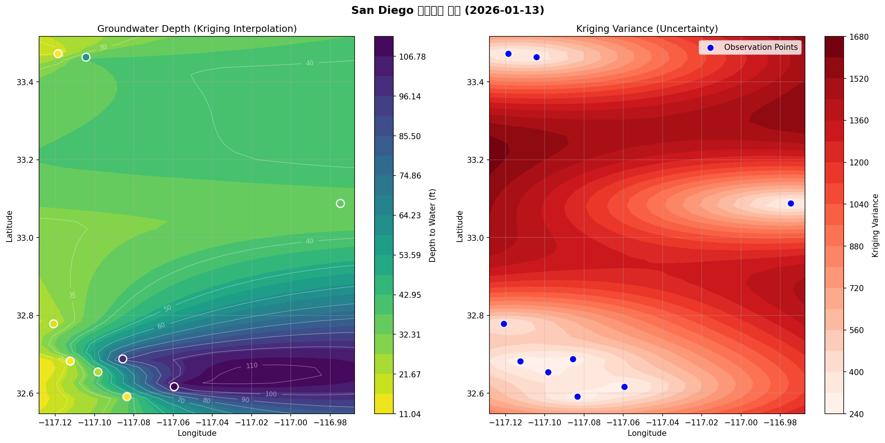

# USGS GroundWater

USGS 지하수 데이터 수집, Kriging 보간, 시각화를 위한 MCP(Model Context Protocol) 기반 AI 에이전트 시스템입니다.

## 주요 기능

- **USGS NWIS API 연동**: 미국 전역의 지하수 관측소 데이터 실시간 조회
- **Kriging 공간 보간**: Ordinary Kriging을 통한 지하수위 분포 예측
- **자동 시각화**: 등고선 맵, 불확실성 맵 자동 생성
- **Claude Code 통합**: 자연어 명령으로 전체 분석 파이프라인 실행

## 아키텍처

```
┌─────────────────────────────────────────────────────────────────┐
│                        Claude Code                               │
└─────────────────────────────────────────────────────────────────┘
                              │
                              ▼
┌─────────────────┐    ┌─────────────────┐    ┌─────────────────┐
│   usgs-gwinfo   │───▶│     kriging     │───▶│visualize-kriging│
│                 │    │                 │    │                 │
│ • 관측소 조회    │    │ • Ordinary      │    │ • 등고선 맵     │
│ • 수위 데이터    │    │   Kriging       │    │ • 불확실성 맵   │
│ • CSV 출력      │    │ • 다중날짜 보간  │    │ • GIF 애니메이션│
│                 │    │ • .dat/.csv출력  │    │ • 비교 플롯     │
└─────────────────┘    └─────────────────┘    └─────────────────┘
        │                      │                      │
        ▼                      ▼                      ▼
   [CSV 데이터]          [.dat/.csv]            [PNG/GIF 이미지]
```

## 설치

### 요구사항
- Python 3.10+
- Claude Code (MCP 클라이언트)

### 의존성 설치

```bash
# 기본 의존성
pip install -r requirements_usgs.txt

# Kriging 및 시각화 (전체 기능)
pip install pykrige matplotlib

# GeoTIFF 출력 (선택)
pip install rasterio
```

### Claude Code 설정

`.mcp.json` 파일이 프로젝트 루트에 포함되어 있습니다. Claude Code가 자동으로 MCP 서버를 인식합니다.

## 사용법

### Claude Code에서 사용

자연어로 분석 요청:

```
San Diego 지역의 1월 13일 지하수 데이터를 가져와서 시각화해줘
```

Claude Code가 자동으로:
1. USGS API에서 데이터 수집
2. Kriging 보간 수행
3. 시각화 이미지 생성

### 개별 MCP 서버 실행

```bash
# 데이터 수집
python usgs_gwinfo_mcp.py

# Kriging 보간
python kriging_mcp.py

# 시각화
python visualize_mcp.py
```

## MCP 도구 목록

### usgs-gwinfo

| 도구 | 설명 |
|------|------|
| `get_groundwater_sites` | 경계 상자 내 관측소 목록 조회 |
| `get_groundwater_data` | 지정 기간의 지하수위 데이터 조회 및 CSV 출력 |
| `get_groundwater_data_single_date` | 단일 날짜 지하수위 데이터 조회 |
| `get_site_history` | 특정 관측소의 과거 데이터 조회 |

### kriging

| 도구 | 설명 |
|------|------|
| `kriging_interpolate` | 단일 날짜 Ordinary Kriging 보간 수행 |
| `kriging_interpolate_multiple` | 다중 날짜 Kriging 보간 (섹션 형식 .dat 출력) |
| `get_variogram_models` | 사용 가능한 베리오그램 모델 목록 |

### visualize-kriging

| 도구 | 설명 |
|------|------|
| `visualize_kriging_result` | Kriging 결과 시각화 (PNG/GIF 애니메이션) |
| `get_available_colormaps` | 사용 가능한 컬러맵 목록 |
| `create_comparison_plot` | 두 데이터셋 비교 플롯 |

## 예시

### 입력: San Diego 지역 지하수 분석

```
bbox: -117.5,32.5,-116.5,33.5
date: 2026-01-13
aquifer_type: U (Unconfined)
```

### 출력

**데이터 요약:**
- 관측 지점: 20개
- 지하수위 범위: 6.74 ~ 128.24 ft

**시각화 결과:**



- 왼쪽: Kriging 보간 지하수위 분포 (노란색=얕음, 파란색=깊음)
- 오른쪽: 불확실성(분산) 분포

## 주요 지역 경계 상자

| 지역 | bbox |
|------|------|
| San Diego | `-117.5,32.5,-116.5,33.5` |
| Los Angeles | `-118.7,33.7,-117.5,34.4` |
| Central Valley | `-122.5,35.0,-118.5,40.5` |
| San Francisco Bay | `-123.0,37.0,-121.5,38.5` |

## 프로젝트 구조

```
usgs-groundwater/
├── .mcp.json                 # MCP 서버 설정
├── usgs_gwinfo_mcp.py        # USGS 데이터 수집 MCP 서버
├── kriging_mcp.py            # Kriging 보간 MCP 서버
├── visualize_mcp.py          # 시각화 MCP 서버
├── requirements_usgs.txt     # Python 의존성
├── CLAUDE.md                 # Claude Code 가이드
├── USGS_NWIS_GUIDE.md        # USGS API 가이드
└── USGS_GWINFO_MCP_GUIDE.md  # MCP 서버 사용 가이드
```

## 기술 스택

- **데이터 수집**: USGS NWIS REST API
- **공간 보간**: PyKrige (Ordinary Kriging)
- **시각화**: Matplotlib
- **AI 통합**: Model Context Protocol (MCP)
- **래스터 출력**: Rasterio (선택)

## 참고 자료

- [USGS Water Services](https://waterservices.usgs.gov/)
- [Model Context Protocol](https://modelcontextprotocol.io/)
- [PyKrige Documentation](https://geostat-framework.readthedocs.io/projects/pykrige/)

## 라이선스

MIT License
